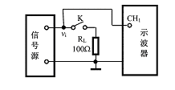
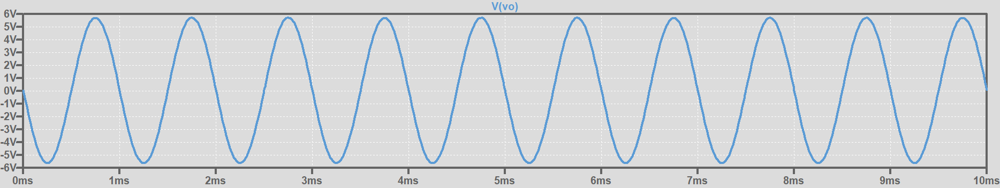
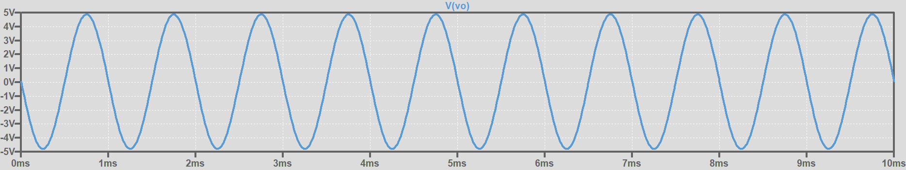
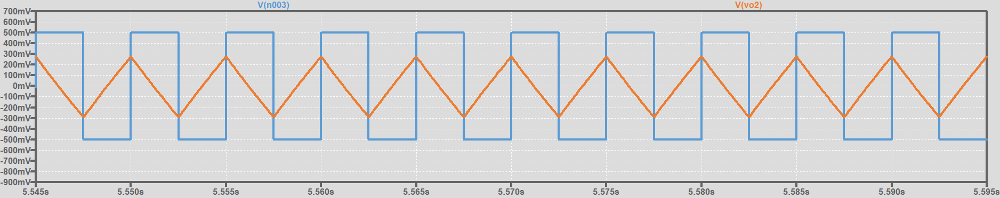
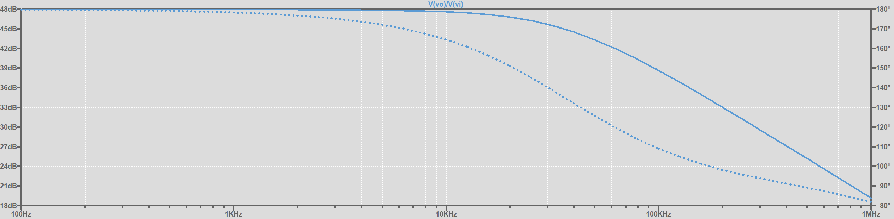

# 实验一：集成运算放大器的基本应用

## 一、实验目的

1. 熟练掌握集成运算放大器的正确使用方法。

2. 掌握用集成运算放大器构成各种基本运算电路的方法。

3. 学会合理选用示波器的直流、交流耦合方式观察不同波形的方法。

## 二、实验内容

### 任务一：研究电压跟随器的作用

(1) 按图连接电路

**断开开关K**。输入f 为1kHz,vipp=1V的正弦信号，用示波器观察输出波形。

**闭合开关K**。观察输出波形的变化情况。

分别记录K闭合前、后信号源输出信号的峰-峰值，计算信号源的内阻RS，并解释100W负载电阻连接到信号源上产生的负载效应。

（2）按图连接电路。

仍然从信号源送出频率为1kHz、峰-峰值为1V的正弦信号，用示波器观察输入、输出波形（幅值与相位关系）。分别记录接上RL和去掉RL两种情况下输出信号vo的大小，并解释观察到的实验现象。

### 任务二：反向比例加法电路

(1)按照图c在面包板上组装电路。电阻值取RF=100kΩ,R1=10kΩ,R2= 5.1kΩ，安装电阻前先用万用表测试电阻值填入表a中。

(2)按照图c连接分压电路，其中Rs1=Rs2=1kΩ.将v1和v2连至图c对应输入端。

(3)检查无误后接通电源。从信号源送出频率为1kHz、峰-峰值为300mV 的正弦信号。用示波器测得v1、v2和vo。 填入表a中，并记录它们的波形。

(4)关闭电源，将Rs2改为500Ω,检查无误后接通电源，再次用示波器测得v1、v2和vo填入表a中。

### 任务三：积分电路

如图所示在面包板上组装电路。取$R_1$=10kΩ, $R_F$=100kΩ,C=0.22μF, $R_P$= 10kΩ，输入f=200Hz,峰峰值为1V的正方波。用示波器测试vi和vo,并画出其波形。

### 补充
输入电压和输出电压的关系为：

$$
V_{0}=-(\frac{R_F}{R_1}V_1+\frac{R_{F}}{R_{2}}V_2)
$$

取 $R_F=100 \mathrm{K}\Omega, R_1=10 \mathrm{K} \Omega, R_2=5.1{\mathrm{K}}\Omega$

当 $R_{s1}=R_{s2}=1 \mathrm{K}\Omega $时, $v_1=v_{s}=0.3\mathrm{V}$, $v_2=\frac{v_s}{2}=0.15 \mathrm{V}$ ,

理论值 $V_o=-(\frac{100k}{10k}\times0.3+\frac{100k}{5.1k}\times 0.15) = -5.941\mathrm{V}$

仿真值 $V_{o}=5.708 \mathrm{V}$

当 $R_{s1}=1\mathrm{K}\Omega, R_{s_2}=500\Omega$时, $v_1=v_{s}=0.3 \mathrm{V}$, $v_2=\frac{v_s}{3}=0.1 \mathrm{V}$,

理论值 $V_o=-(\frac{100k}{10k}\times0.3+\frac{100k}{5.1k}\times 0.1) = -4.961 \mathrm{V}$

仿真值 $V_{o}=-4.851 \mathrm{V}$

### 任务三：比例积分电路测试

$R_F>>R_1$时，电路的输出电压可近似为：

$$
v_o(t)=-\frac{1}{R_1C} \int_{0}^{t} v_{t} \mathrm{d}t + v_{o}(0)
$$

仿真值 $v_{omax}=276.77366mV$

### 选做任务--高增益电压放大器

$\diamond$ 设计一高增益电压放大器，要求：输入信号为正弦交流电压
信号，峰峰值 $V_{ipp}=100\mathrm{mV}$，频率 $f_i=10\mathrm{kHz}$，输出信号峰峰
值 $V_{opp}=24\mathrm{V}$，且与输入信号反相。电路输入阻抗大于 $1\mathrm{M\Omega}$，输出阻抗小于 $100\mathrm{\Omega}$

（1）提出电路设计方案，画出电路原理图，要求标示出电阻
元件参数和电源值；简述电路的工作原理。

（2）对电路进行仿真，验证你所设计的电路能满足设计要求。

（3）插板实现所设计的电路，测试电路的性能指标，验证你
所设计实现的电路能够满足设计要求。

（4）当输入信号为1MHz，请问上述电路还能满足所要求的
增益，输入阻抗与输出阻抗指标吗？描述电路性能指标变化的
原因，并提出改进方案。

